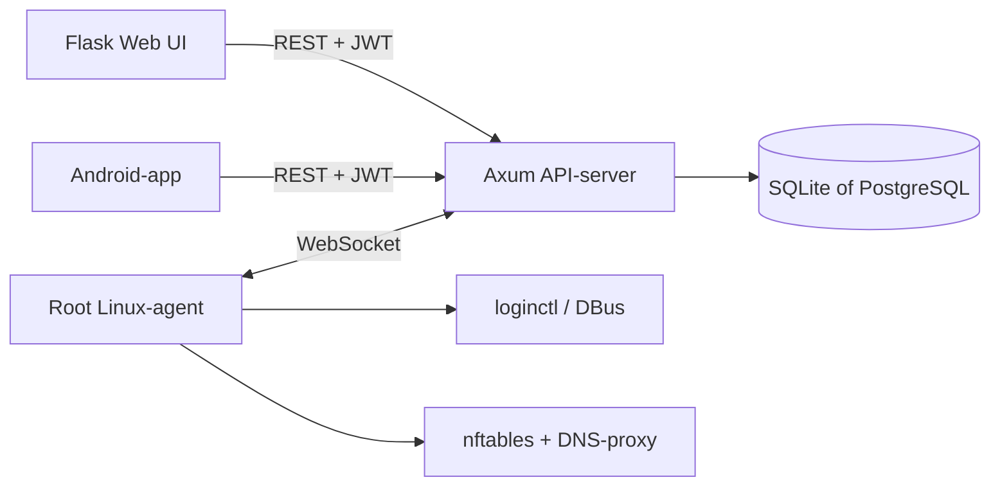

# Repository-analyse ScreenGuard

Datum: 14 september 2026  
Geanalyseerde versie: `v0.10.9` (`main`, commit `8c4ba69`)

## Scope

Deze analyse behandelt de architectuur, beveiliging, betrouwbaarheid, testdekking en onderhoudbaarheid van de lokale ScreenGuard-repository. De repository bevat ongeveer 12.500 regels applicatiecode, verdeeld over een Rust-server, Linux-agent, tray-app, gedeeld protocol en Flask-webinterface.

## Architectuur



De componentgrenzen zijn logisch:

- `common` definieert het wire-protocol en gedeelde modellen.
- `server` verzorgt REST, WebSockets, planning, tijdregistratie en opslag.
- `agent` bewaart beleid lokaal en handhaaft dit ook tijdens netwerkuitval.
- `webui` fungeert als server-side frontend en API-proxy.
- SQLite en PostgreSQL worden via `sqlx::Any` ondersteund.

## Geprioriteerde bevindingen

### 1. Kritiek: agents worden feitelijk niet geauthenticeerd

De agent stuurt zijn bearer-token correct mee in `crates/agent/src/ws_client.rs`, maar de WebSocket-handler van de server leest de `Authorization`-header niet. Bij het eerste `agent_hello` zoekt de server alleen de aangeleverde `machine_id` op en controleert hij in `crates/server/src/ws.rs` of de status `paired` is.

Het opgeslagen `auth_token_hash` wordt nergens ter verificatie gebruikt. Iedereen die een geldige `machine_id` kent of raadt, kan daardoor:

- zich voordoen als die agent;
- gebruikerslijsten en gebruiksdata manipuleren;
- log-responses vervalsen;
- beleidsconfiguratie voor die machine ontvangen;
- de echte agent uit de online-map verdringen.

**Aanbeveling:** lees de bearer-header tijdens de WebSocket-upgrade, hash het aangeboden token en vergelijk dit constant-time met `auth_token_hash`. Weiger de upgrade of sluit de verbinding voordat een `agent_hello` wordt verwerkt als de verificatie mislukt.

### 2. Kritiek: anonieme pairing kan een bestaande agent uitschakelen

Een pairing request is anoniem. Wanneer de opgegeven `machine_id` al bestaat, zet `upsert_agent_pending` in `crates/server/src/db.rs` de status terug naar `pending`.

Een aanvaller kan dus een gekoppelde agent met alleen diens machine-ID ontkoppelen. Als een beheerder het nieuwe pairing-verzoek accepteert, ontvangt de aanvaller bovendien het nieuwe token.

**Aanbeveling:** laat een anonieme pairing request nooit een bestaand `paired` record wijzigen. Herkoppelen moet een expliciete, geauthenticeerde beheeractie met een eenmalige challenge zijn.

### 3. Hoog: de webinterface mist CSRF-bescherming

Vrijwel alle beheeracties zijn gewone POST-formulieren, waaronder:

- agents verwijderen of accepteren;
- profielen verwijderen;
- limieten en schema's wijzigen;
- accounts direct vergrendelen;
- meldingen sturen.

Er is geen CSRF-token of origincontrole. Omdat de browser automatisch de Flask-sessiecookie meestuurt, kan een externe site acties uitvoeren zodra een beheerder is ingelogd.

**Aanbeveling:** voeg globale CSRF-bescherming toe, bijvoorbeeld via Flask-WTF, en configureer de sessiecookie expliciet met een geschikte `SameSite`-waarde, `HttpOnly` en bij HTTPS ook `Secure`.

### 4. Hoog: onveilige standaardgeheimen en eerste configuratie

De webinterface valt in `webui/app.py` terug op `dev-secret-change-me`. De Docker Compose-configuratie publiceert bekende voorbeeldgeheimen terwijl beide services host networking gebruiken.

Daarnaast is `/auth/setup` publiek zolang er nog geen admin bestaat. Omdat de server standaard op `0.0.0.0` luistert, kan iemand op het bereikbare netwerk de eerste admin registreren.

**Aanbevelingen:**

- weiger productie-start bij ontbrekende of bekende standaardgeheimen;
- genereer geheimen automatisch tijdens installatie;
- bind initiële setup aan localhost of vereis een setup-token;
- voeg rate limiting toe aan login, setup en pairing.

### 5. Middel: domain-ID's worden niet aan het profiel gekoppeld

De update- en delete-routes ontvangen zowel `profile_id` als `domain_id`, maar de databasequery gebruikt alleen `domain_id`. Daardoor kan een request via profiel A een domainrecord van profiel B wijzigen of verwijderen. Daarna wordt ook de configuratieversie van profiel A verhoogd.

**Aanbeveling:** koppel beide waarden in de update- en deletequery:

```sql
WHERE id = $1 AND profile_id = $2
```

### 6. Middel: webfiltering is eenvoudig te omzeilen

De filter onderschept klassieke DNS op poort 53 en blokkeert een vaste lijst met bekende DoH-IP's. Dit biedt beperkte controle, want gebruikers kunnen onder meer:

- andere of eigen DoH-providers gebruiken;
- rechtstreeks IP-adressen benaderen;
- een VPN of proxy gebruiken;
- QUIC of HTTPS naar niet-opgenomen resolvers gebruiken.

**Aanbeveling:** presenteer dit in de documentatie en UI als best-effort filtering. Voor sterkere handhaving is een allowlist, netwerkbreed beleid of gecontroleerde proxy nodig.

### 7. Middel: CI valideert releases, maar geen wijzigingen

Er zijn 78 Rust-tests, waaronder nuttige tests voor database-migraties, gebruikssynchronisatie, offline state en DNS-regels. De GitHub Actions-workflow draait echter alleen bij tags en bouwt binaries. Tests, `rustfmt` en `clippy` ontbreken bij pushes en pull requests.

**Aanbeveling:** voeg een push- en pull-requestworkflow toe met:

```bash
cargo fmt --all -- --check
cargo clippy --workspace --all-targets -- -D warnings
cargo test --workspace
python -m compileall -q webui
```

Voor de Flask-laag zijn momenteel geen tests aanwezig.

## Sterke punten

- De Rust-code gebruikt geen `unsafe`.
- Argon2 wordt correct gebruikt voor adminwachtwoorden.
- JWT-validatie gebruikt de bibliotheekstandaarden en controleert expiratie.
- SQL-waarden worden consequent gebonden; er is geen directe SQL-injectie aangetroffen.
- Offline handhaving en cumulatieve gebruikssynchronisatie zijn zorgvuldig ontworpen.
- De recente fix voorkomt dubbeltelling bij `usage_sync`.
- De agent gebruikt oplopende reconnect-backoff.
- Systeemdiensten bevatten hardening zoals `ProtectSystem`, `PrivateTmp` en `NoNewPrivileges`.
- De database ondersteunt migraties en referentiële verwijdering.
- De repository bevat een Cargo-lockfile en duidelijke installatie- en architectuurdocumentatie.

## Onderhoudbaarheid

De grootste onderhoudsschuld zit in enkele zeer grote bestanden:

- `crates/server/src/db.rs`: circa 1.930 regels;
- `crates/agent/src/heartbeat.rs`: circa 1.050 regels;
- `crates/agent/src/db.rs`: circa 976 regels;
- `webui/templates/profile.html`: circa 717 regels;
- `webui/app.py`: circa 635 regels.

Opsplitsing per domein, zoals agents, profielen, usage, migraties en webfiltering, zal reviews en beveiligingstests eenvoudiger maken.

De versies van `common`, `agent` en `server` lopen uiteen (`0.10.2` tegenover `0.10.9`), wat verwarring bij protocolcompatibiliteit kan veroorzaken. Python-afhankelijkheden hebben alleen minimumversies; een lockfile of hashes zouden deployments reproduceerbaarder maken.

## Aanbevolen uitvoeringsvolgorde

1. WebSocket-tokencontrole implementeren.
2. Veilige herkoppeling en bescherming van bestaande agents implementeren.
3. CSRF-bescherming en veilige cookie-instellingen toevoegen.
4. Setup, standaardgeheimen en rate limiting aanscherpen.
5. Domainrecords aan het opgegeven profiel binden.
6. CI voor tests, formattering en linting toevoegen.
7. Grote bronbestanden opsplitsen en afhankelijkheden reproduceerbaar vastleggen.

De eerste twee bevindingen maken de huidige agent-server trust boundary onvoldoende veilig voor een onbeheerd of publiek bereikbaar netwerk.

## Uitgevoerde validatie

- Git-status was schoon; `main` was gelijk aan `origin/main` en tag `v0.10.9`.
- Python-bronnen compileerden en parseerden zonder fouten.
- Er zijn 78 Rust-tests en geen Python-testbestanden aangetroffen.
- Er is geen gebruik van `unsafe` in de Rust-code aangetroffen.
- Rust-tests, formattering en Clippy konden lokaal niet worden uitgevoerd omdat `rustup` geen standaard-toolchain had ingesteld.
- De repository bevat geen `rust-toolchain.toml`, waardoor de vereiste compiler niet automatisch wordt vastgelegd.
